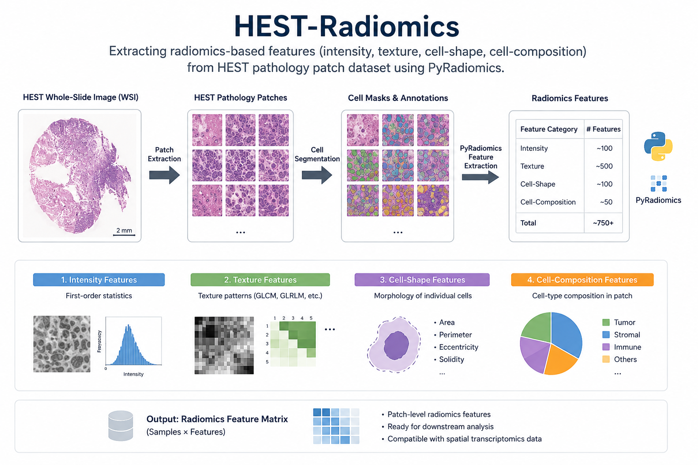

# HEST-Radiomics (hestradiomics)

[](https://hest-radiomics.readthedocs.io/en/latest/) 
[](https://www.python.org/downloads/)
[](https://pytorch.org/)
[](https://github.com/mahmoodlab/HEST)
[](LICENSE)

Radiomics feature extraction pipeline for HEST spatial transcriptomics datasets using WSI patches, cell segmentation, and PyRadiomics-based handcrafted features. 



---

## Features

- Patch-level radiomics extraction
- Cell-aware radiomics using CellViT segmentation
- HEST dataset integration
- HDF5 / H5AD support
- Parallelized extraction pipeline
- Spatial transcriptomics compatible workflow


---

## Quick Start

### 1. Create environment

Firstly, create and activate conda environment: 
```bash
conda create -n hestradiomics python=3.10  # cellvit requires >=3.10
conda activate hestradiomics 
```

### 2. Install PyTorch
Install `torch` and `torchvision`, matching with your cuda environment: 
```bash
# example 
pip install torch torchvision torchaudio --index-url https://download.pytorch.org/whl/cu121
pip install "numpy<2.0.0,>=1.24"  # avoid NumPy 2.x compatibility issues
```

### 3. Install hestradiomics
Then: 
```bash
git clone https://github.com/gyoenge/hest-radiomics.git
cd hest-radiomics/
# inside the hest-radiomics/ directory 
pip install -e . --no-build-isolation
```

### 4. Install CellViT
The segmentation engine additionally requires `cellvit`:
```bash
conda install -c conda-forge openslide
pip install openslide-python openslide-bin
pip install cellvit
```

### 5. Run pipeline
Run the extraction pipeline:
```bash 
export LD_LIBRARY_PATH=$CONDA_PREFIX/lib:$LD_LIBRARY_PATH
python src/hestradiomics/run.py
```


